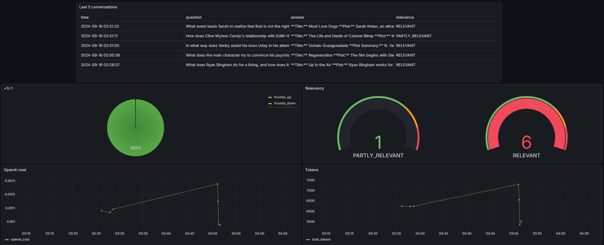

# <h1 style="text-align: center; font-family: sans-serif; letter-spacing: 0.4em; font-size: 4em;">MOVIE     ADVISOR</h1>


## 1.1. Problem Description

When trying to recall the title of a movie or deciding what to watch based on a specific plot or genre, many people struggle to find reliable recommendations or remember titles. With an overwhelming number of movies available, traditional search engines or platforms may not provide the best experience for personalized recommendations based on vague descriptions.

**Movie Advisor** addresses this challenge by using a Retrieval-Augmented Generation (RAG) approach to assist users in recalling movie titles based on partial plot descriptions or suggest movies to watch from a vast dataset. By leveraging both retrieval and generation techniques, the system provides relevant and accurate suggestions, enhancing the movie discovery process.

## 1.2. Project Description
Movie Advisor interacts with users via a conversational interface, allowing them to either:

- Input partial or vague movie plot descriptions to recall the exact movie title.
- Request movie recommendations based on their preferred genres or specific plot elements.

This project has been developed within the `llm-zoomcamp` by [DataTalksClub](https://github.com/DataTalksClub).

**Technologies**

  - `Python 3.12`
  - `Docker` to run Elasticsearch
  - `Elasticsearch` for full-text search
  - `OpenAI` as an LLM
  - `Flask` as the API interface
---

**a) RAG flow**

  The application employs a RAG flow to retrieve relevant movie information and generate suitable suggestions, providing a seamless and efficient solution for movie selection and recall.

**b) Retrieval evaluation**

  3 defferent retrievals has been evaluated ([Minsearch](https://github.com/alexeygrigorev/minsearch), `Elastic search - text search` and `Elastic search - vector search`) by 2 metrics `hit rate` and `MRR`. The best results are provided by `Elastic search - text search` so it is utilized in the app.

  Check the [Experiments](#experiments) for details.

**c) RAG evaluation**

  2 LLMs were evaluated (`gpt_4o_mini` and `gpt-3.5-turbo-0125`) with LLM-as-a-Judge metric. The best result is provided by `gpt_4o_mini` so it is utilized in the app.

  Check the [Experiments](#experiments) for details.

**d) Interface**

  The Flask is used for serving the application as an API.


**e) Ingestion**

  The ingestion script is located in `ingest.py`.

  Since the application uses `Elasticsearch`, the container with ES also runs automatically within `ingest.py`. Therefore, the ingestion script is executed at the startup of the application.

  It is triggered inside `rag.py` when we import it.

**d) Monitoring and Evaluation**
  
  The system incorporates comprehensive monitoring and evaluation mechanisms to ensure quality and efficiency:

  - **User Feedback Collection:** User feedback is continuously gathered to assess satisfaction and accuracy.
  - **LLM-based Evaluation:** We employ an "LLM-as-a-Judge" approach to automatically evaluate the quality of each generated response.
  - **Performance Metrics:** Key metrics, including response generation time, token usage, and LLM cost, are tracked.
  - **Visualization:** All monitoring data is consolidated and visualized in Grafana, providing real-time insights and performance analytics.

  Check the [Monitoring and Visualization](#3-monitoring-and-visualisation) for details.

**e) Containerization**

  To streamline the setup of dependencies, a `docker-compose` configuration is provided for `PostgreSQL` and `Grafana`. This configuration simplifies the process of setting up and managing these required services.

  Additionally, `Elasticsearch` is included in a Docker container that runs automatically as part of the `ingest.py` script.

**f) Reproducibility**

  I hope the following instructions are clear and straightforward. The dataset is readily accessible, and running the code is designed to be easy and efficient. If you encounter any issues or have questions, please feel free to reach out.


## 1.3. Data Description

The dataset consists **5,000 movies**, each described by the following attributes:

  - **Title**: The name of the movie
  - **Year**: The release year
  - **Plot**: A brief summary of the movie's storyline
  - **Genres**: The categories the movie belongs to (e.g., comedy, drama)
  - **Director**: The name of the director

A sample of the data is shown below:

```plaintext
[{'title': 'Patton Oswalt: Annihilation',
  'year': '2017',
  'plot': 'Patton Oswald, despite a personal tragedy, produces his best standup yet. Focusing on the tribulations of the Trump era and life after the loss of a loved one, Patton Oswald continues his journey to contribute joy to the world.',
  'genres': 'uncategorized',
  'director': 'Bobcat Goldthwait'},
 {'title': 'New York Doll',
  'year': '2005',
  'plot': 'A recovering alcoholic and recently converted Mormon, Arthur "Killer" Kane, of the rock band The New York Dolls, is given a chance at reuniting with his band after 30 years.',
  'genres': 'documentary, music',
  'director': 'Greg Whiteley'}]
```

You can find data in `data/movie_dataset.csv`

# 2. Running and using the application

It is better to use Codespaces to run this application.

## 2.1. Preparation

### 2.1.1. Enviroment preparation

**a) OpenAI API key installation**
The application uses OpenAI, so you need OpenAI API key:
1. Install `direnv`.
    ```bash
    sudo apt update
    sudo apt install direnv
    echo 'eval "$(direnv hook bash)"' >> ~/.bashrc
    source ~/.bashrc
    ```
2. Copy `.envrc_template` into `.envrc`.
3. Insert your API key into `.envrc`.
4. Run `direnv allow` to load the key into your environment.
    ```bash
    direnv allow
    ```

**b) Dependencies installation**

5. Make sure you have `pipenv` installed:

    ```bash
    pip install pipenv
    ```
6. Install the app dependencies:

    ```bash
    pipenv install --dev
    ```

### 2.1.2. Database configuration

The database needs to be initialized before the application starts for the first time.

1. Run `postgres`

    ```bash
    docker-compose up postgres
    ```

2. In new terminal initialize database

    ```bash
    pipenv shell
    cd movie_advisor
    export POSTGRES_HOST=localhost
    python db_prep.py
    ```

    To check the content of the database

    ```bash
    pipenv run pgcli -h localhost -U your_username -d course_assistant -W
    ```


## 2.2. Running the application

The Flask is used for serving the application as API.

To run the application:


```bash
python app.py
```

## 2.3. Usage the application

### 2.3.1. Using request

  When the application is running, you can use `requests` to send questions for testing it. You can change the questtion in the [test.py](test.py) if needed.

  Open new terminal and run the command:

  ```bash
  pipenv run python test.py
  ```

### 2.3.2. You can also use `curl`

Open new terminal and run the commands:
    
  - To ask the question (*change question if needed*)
    ```bash 
    URL="http://localhost:5000"
    QUESTION="What does Ryan Bingham do for a living, and how does it relate to his frequent travels?"

    curl -X POST "${URL}/ask" \
      -H "Content-Type: application/json" \
      -d "{\"question\": \"$QUESTION\"}"
    ```

    The answer will look like:

    ```bash
    {
      "conversation_id": "ae55eeaa-3f6a-45d9-9640-71d9202d8dac",
      "question": "What is the name of the movie where Ryan Bingham made a living by traveling frequently?",
      "result": "The movie you are looking for is **Up in the Air**. In this film, Ryan Bingham works for a Human Resources consultancy firm, making his living by traveling frequently across the United States to conduct layoffs and firings on behalf of employers. He is also a frequent flyer who aspires to accumulate ten million frequent flyer miles. The film explores his life, philosophies, and relationships during his travels. Directed by Jason Reitman, it was released in 2009 and falls under the comedy-drama genre."
    }
    ```

  - To provide feedback (*change the conversation ID*)
    ```bash
    ID="ca20e77a-f1c0-4614-ac75-1cfaac4a1d36"
    FEEDBACK=1
    URL="http://localhost:5000"
    FEEDBACK_DATA='{
      "conversation_id": "'${ID}'",
      "feedback": '${FEEDBACK}'
    }'

    curl -X POST "${URL}/feedback" \
      -H "Content-Type: application/json" \
      -d "${FEEDBACK_DATA}"
    ```

    The reply will look like:
    ```bash
    {
      "conversation_id": "ca20e77a-f1c0-4614-ac75-1cfaac4a1d36",
      "feedback": 1,
      "message": "Feedback received. Thank you"
    }
    ```


# 3. Monitoring and Visualisation

Monitoring is available through Grafana.

## 3.1. Running Grafana

1. Open a new terminal window:

    ```bash
    docker-compose up -d grafana
    ```

2. Check the status of Grafana:

    ```bash
    docker ps | grep grafana
    ```

3. If everything is running correctly, proceed with the following steps:

    ```bash
    pipenv shell

    cd grafana

    # Ensure the POSTGRES_HOST environment variable is not overwritten
    env | grep POSTGRES_HOST

    python init.py
    ```

## 3.2. Accessing the Dashboard

1. Navigate to [http://localhost:3000](http://localhost:3000).

    - **Login:** `admin`
    - **Password:** `admin`

2. When prompted, you can keep the default "admin" password.

3. Open the Dashboards to view the available metrics.

You should see a dashboard similar to the example below:




# 4. Experiments

### 4.1. RAG flow

For experiments, I used Visual Studio Code.

The notebook with experiments is located in the [rag-test.ipynb](/notebooks/rag-test.ipynb) file.

The ground-truth questions for evaluation are generated in the [evaluating-data-generation.ipynb](notebooks/evaluating-data-generation.ipynb) file.

### 4.2. Retrieval evaluation

I evaluated 3 different retrieval methods:

- minisearch
- elastic-search
- elastic-search vector

Here are the results:

| search_function     | hit_rate | mrr      |
|---------------------|----------|----------|
| minisearch          | 0.392    | 0.274533 |
| elastic_search      | 0.884    | 0.836800 |
| elastic_search_knn  | 0.636    | 0.540400 |


The best results are provided by `elastic-search retrieval`, so I will continue with it.

### 4.3. RAG evaluation

I have evaluated 2 different LLMs with LLM-as-a-Judge metric:

- `gpt-4o-mini`
- `gpt-3.5-turbo-0125`

Here are the results:
<div>
<table class="dataframe">
  <thead>
    <tr style="text-align: right;">
      <th></th>
      <th></th>
      <th>count</th>
      <th>count_norm</th>
    </tr>
    <tr>
      <th>model</th>
      <th>relevance</th>
      <th></th>
      <th></th>
    </tr>
  </thead>
  <tbody>
    <tr>
      <th rowspan="3" valign="top">gpt-3.5-turbo-0125</th>
      <th>NON_RELEVANT</th>
      <td style="text-align: center;">44</td>
      <td style="text-align: center;">8.8%</td>
    </tr>
    <tr>
      <th>PARTLY_RELEVANT</th>
      <td style="text-align: center;">53</td>
      <td style="text-align: center;">10.6%</td>
    </tr>
    <tr>
      <th>RELEVANT</th>
      <td style="text-align: center;">153</td>
      <td style="text-align: center;">30.6%</td>
    </tr>
    <tr>
      <th rowspan="3" valign="top">gpt-4o-mini</th>
      <th>NON_RELEVANT</th>
      <td style="text-align: center;">7</td>
      <td style="text-align: center;">1.4%</td>
    </tr>
    <tr>
      <th>PARTLY_RELEVANT</th>
      <td style="text-align: center;">11</td>
      <td style="text-align: center;">2.2%</td>
    </tr>
    <tr>
      <th>RELEVANT</th>
      <td style="text-align: center;">232</td>
      <td style="text-align: center;">46.4%</td>
    </tr>
  </tbody>
</table>
</div>


The best result is provided by `gpt-4o-mini`, so I will continue with it.


# Acknowledgements

I would like to express our gratitude to [DataTalksClub](https://github.com/DataTalksClub) for the `llm-zoomcamp` resources and to Alexey Grigorev for providing clear and comprehensive instructions. You are the best.
